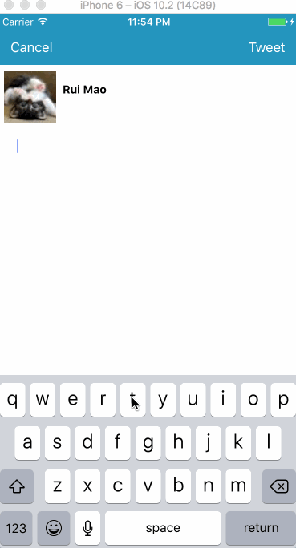

# Twitty
iOS bootcamp 2017 spring week 3 project

This is an iOS application of basic twitter client exploring reading and writing to the authenticated [Twitter API](https://dev.twitter.com/rest/tools/console).

Time spent: 16 hours spent in total

Completed user stories:

Login page: 
 * [x]Required: User can sign in using OAuth login flow
 * [x]Required: User can view last 20 tweets from their home timeline
 * [x]Required: The current signed in user will be persisted across restarts
 * [x]Required: In the home timeline, user can view tweet with the user profile picture, username, tweet text, and timestamp. 
 * [ ]Required: User can pull to refresh
 
 Tweet page: 
 * [ ]Required: User can tap on a tweet to view it, with controls to retweet, favorite, and reply.
 * [ ]Optional:  Retweeting and favoriting should increment the retweet and favorite count.
 * [ ]Optional:  User should be able to unretweet and unfavorite and should decrement the retweet and favorite count. Refer to this guide for help on implementing unretweeting.
 * [ ]Optional:  Replies should be prefixed with the username and the reply_id should be set when posting the tweet,
 * [ ]Optional:  User can load more tweets once they reach the bottom of the feed using infinite loading similar to the actual Twitter client.
 
 Compose page: 
  * [ ]Required: User can compose a new tweet by tapping on a compose button.
  * [ ]Optional:  When composing, you should have a countdown in the upper right for the tweet limit.
  * [ ]Optional:  After creating a new tweet, a user should be able to view it in the timeline immediately without refetching the timeline from the network.
  
  
Walkthrough of all user stories:

GIF created with [LiceCap](http://www.cockos.com/licecap/).
